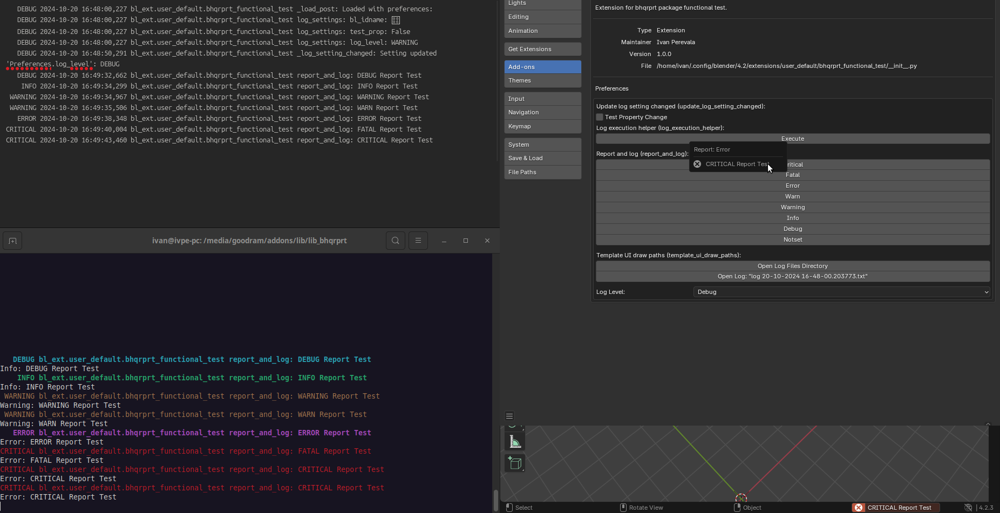

### Python Logging and Blender Integration Package

This Python package is designed to streamline the process of logging for both Python applications and Blender addon development. It provides advanced logging features such as automatic log file management, colored console outputs, and a specialized API for seamless integration with Blender's operator execution processes. Whether you're developing for Blender or a general Python project, this package ensures an efficient, structured, and easy-to-read logging experience.



#### Core Features:

1. **Simultaneous Console and File Logging:**
   The package offers the ability to log messages both to the console and to log files simultaneously. Console logs are color-coded based on severity level for quick readability, while detailed logs are saved in a structured format in log files.

   - **Colored Console Output:**
     Logs are color-coded by severity (e.g., INFO, WARNING, ERROR), making it easy for developers to distinguish between different log levels at a glance. This improves the debugging process by providing visual clarity.
   
   - **Log Level Customization:**
     The package allows developers to control what log level is displayed in the console while all levels are stored in the log files. This way, you can focus on specific messages in real-time while still capturing a full log history for future reference.

2. **Log File Rotation and Cleanup:**
   The package automates the cleanup of old log files, ensuring that your log directory remains manageable over time.

   - **Automatic Log Deletion:**
     When a new log file is created, older logs are automatically deleted based on a user-defined retention policy. You can configure how many logs to keep, preventing your log directory from becoming overcrowded and saving disk space.

   Example:
   ```python
   import bhqrprt
   logs_directory = os.path.join(os.path.dirname(__file__), "logs")
   bhqrprt.purge_old_logs(directory=logs_directory, max_num_logs=30)
   bhqrprt.setup_logger(directory=logs_directory)
   log = logging.getLogger(name=__name__)
   ```

   In this example, old logs are purged automatically, keeping only the most recent 30 log files.

3. **Blender Addon Integration:**
   The package provides a specialized API designed for developers creating Blender addons. This API helps you track operator execution, log settings, and report messages both to the UI and to the log files simultaneously.

   - **Operator Execution Logs:**
     Track the start and end times of Blender operator executions and automatically log these events. This is particularly useful when performance tracking is important or when you need a clear audit trail for Blender's operations.

   - **Logging Settings and Scene Properties:**
     The package allows developers to log Blender settings and scene properties easily. This is valuable when debugging or sharing the current state of the Blender environment.

     Example:
     ```python
     log.debug("Loaded with settings:")
     log.debug("Preferences:")
     bhqrprt.log_settings(log, item=addon_pref)
     
     log.debug("Scene:")
     scene: Scene = context.scene
     scene_props: SceneProps = scene.cpp
     bhqrprt.log_settings(log, item=scene_props)
     ```

     In this example, both the addon's preferences and scene properties are logged, providing insights into the current Blender configuration.

   - **Unified Logging and Reporting:**
     Blender operators often provide feedback to the user through `self.report`. With this package, you can log these messages to the log files while still reporting them in the UI, ensuring both user-facing and internal logs are captured.

     Example:
     ```python
     bhqrprt.report_and_log(
         log,
         self,
         level=logging.WARNING,
         message="Active UV map is missing, continue with limited capabilities",
         msgctxt=msgctxt,
     )
     ```

     Here, a message is both reported in Blender's UI and logged, providing a clear trace of what the user saw and what was logged internally.

4. **Seamless Addon Code Integration:**
   The API is designed to be lightweight and easy to integrate into existing Blender addons, allowing developers to improve their logging without drastically altering their code. You can integrate it in your operator classes, logging key information such as settings and execution statuses.

---

#### Technical Overview:

- **Logging Levels:**
   The package supports all standard logging levels (DEBUG, INFO, WARNING, ERROR, and CRITICAL), giving developers fine-grained control over what gets logged. You can easily configure the console to only display messages above a certain level, while keeping a complete log history in the log files.

- **File Handlers and Retention Policies:**
   Log files are automatically rotated based on the number of files to retain. This ensures that logs don't accumulate endlessly, and older, less-relevant logs are purged automatically. The log directory remains clean and manageable without requiring manual cleanup.

- **Colorized Console Logs:**
   The package uses ANSI escape codes to colorize log messages in the console. Each log level has a distinct color, making it easier to spot critical issues. For instance, ERROR messages might appear in red, while INFO messages are green.

- **Blender-Specific Logging:**
   The Blender addon API is specifically designed to handle common needs in Blender development, such as logging operator execution times and Blender's UI reports. This integration provides comprehensive logging for Blender's unique workflows.

---

#### Usage Examples:

Here are more specific usage examples to help you get started:

**Setting up Logging:**

```python
import bhqrprt

logs_directory = os.path.join(os.path.dirname(__file__), "logs")
bhqrprt.purge_old_logs(directory=logs_directory, max_num_logs=30)
bhqrprt.setup_logger(directory=logs_directory)
log = logging.getLogger(name=__name__)

log.info("Logging has been initialized.")
```

**Logging Settings in Blender Addons:**

```python
log.debug("Loaded with settings:")
log.debug("Preferences:")
bhqrprt.log_settings(log, item=addon_pref)
log.debug("Scene:")
scene: Scene = context.scene
scene_props: SceneProps = scene.cpp
bhqrprt.log_settings(log, item=scene_props)
```

**Unified Reporting and Logging in Blender Addons:**

```python
bhqrprt.report_and_log(
    log,
    self,
    level=logging.WARNING,
    message="Active UV map is missing, continue with limited capabilities",
    msgctxt=msgctxt,
)
```

This package provides a powerful and efficient logging system tailored for both general Python projects and Blender addon development. It simplifies logging processes, ensures efficient log management, and offers deep integration with Blender's operator framework. By leveraging this package, you can streamline your logging workflow, enhance your ability to debug, and optimize your Blender addons with better tracking and reporting capabilities.
