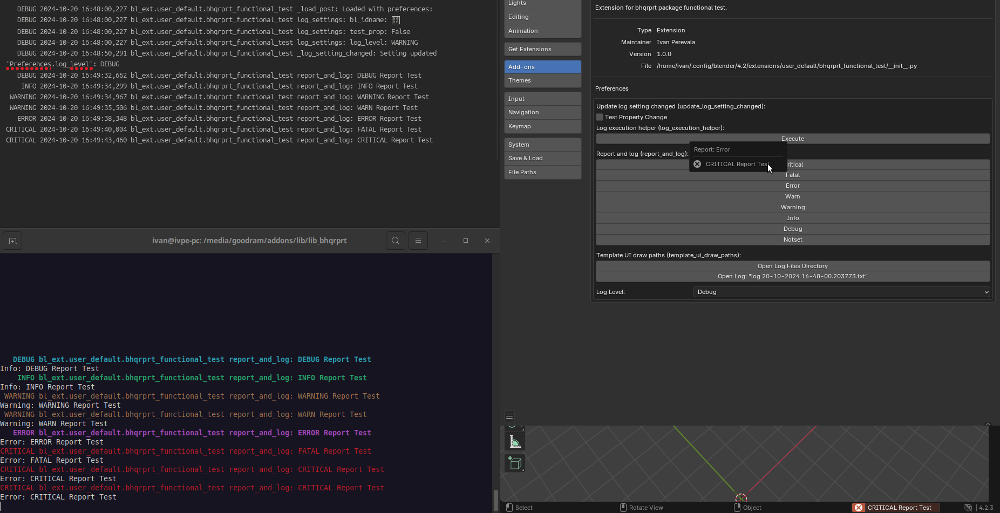

###########
Integration
###########

This section describes methods that can be used to integrate the logging system into Blender addons.
To better understand the process, addon code is provided at the end to test the package's functionality (`bhqrprt_functional_test`):

===================
Basic functionality
===================

These functions can also be used outside of Blender addons. However, for integration into addons, the following changes need to be made:

- **Defining the directory for log files**

In this case, the addon directory (`./logs`) will be used.

.. note::

    It is important that this directory exists at the moment of the call.

.. code-block:: python

    logs_directory = os.path.join(os.path.dirname(__file__), "logs")

- **Deleting unnecessary files**

In this example, the last 30 log files will be kept.

.. code-block:: python

    bhqrprt.purge_old_logs(directory=logs_directory, max_num_logs=30)

- **Initializing the logging system**

This will create a log file for the current session, a custom logger for colorful console output with a custom formatter.

.. code-block:: python

    bhqrprt.setup_logger(directory=logs_directory)

A logger for outputting messages in the current package module.

.. code-block:: python

    log = logging.getLogger(name=__name__)

================
Using in Blender
================

Here are examples of usage in different parts of the addon.

- **Operator execution wrapper**

Here the operator execution method uses a package decorator, so first a log is made about the start of execution, then the original method is called (it may contain initial messages), and then a log is output about the status and execution time.

.. code-block:: python

    @bhqrprt.log_execution_helper
    def execute(self, context):
        log.info("Logging info during operator execution call")
        return {'FINISHED'}

- **Simultaneous report and log** 

The call will make a report in the user interface, write the message to a file, and display it in the console.

.. code-block:: python

    def execute(self, context: bpy.types.Context):
        bhqrprt.report_and_log(
            log, self,
            level=level,
            message=f"DEBUG Report Test",
            msgctxt=""
        )
        return {'FINISHED'}

- **Test property in user settings**

Changing it will log the change in the property's value.

.. code-block:: python

    test_prop: bpy.props.BoolProperty(
        update=bhqrprt.update_log_setting_changed(log, "test_prop"),
        name="Test Property Change",
        description="Changing this property should make a debug log with information about the property name and new value",
    )

- **Displaying log file paths in the user interface**

.. code-block:: python

        bhqrprt.template_ui_draw_paths(log, col, msgctxt="")

============
Full Example
============

.. note:: 
    
    This code will work if the package is correctly installed in Blender.

.. literalinclude:: ../bhqrprt_functional_test/__init__.py
    :language: python
